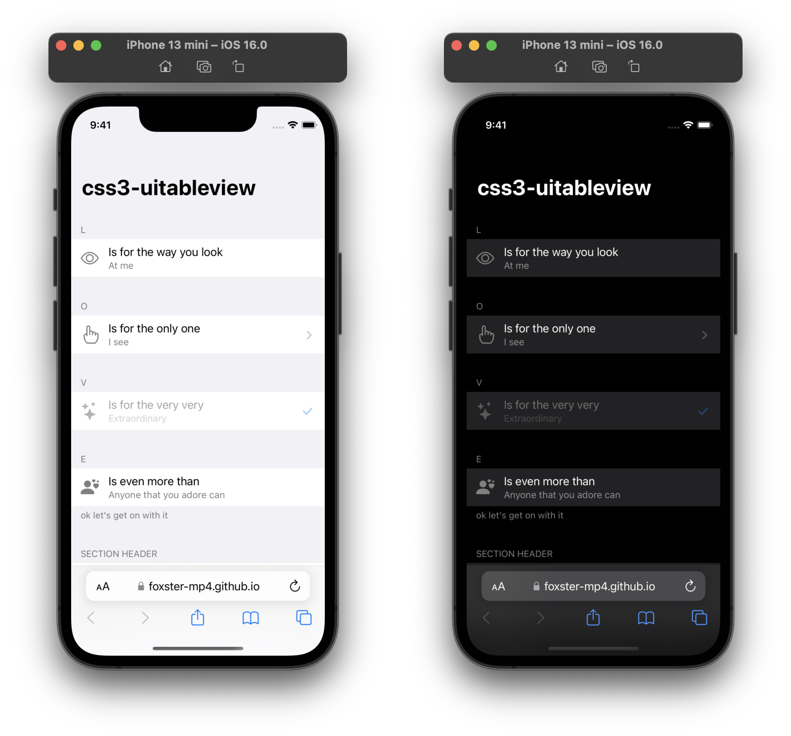

# css3-uitableview
Simple CSS3 framework to achieve a web version of UITableView



## Get Started
To use css3-uitableview in your project, include:

* **uitableview.css**
  ```html
  <link rel="stylesheet" href="https://therealFoxster.github.io/css3-uitableview/src/uitableview.css">
  ```

and one of the following (optional but recommended):
* **uitableview.auto-dark.css** to have the page automatically switch between light/dark appearance to match the system appearance
  ```html
  <link rel="stylesheet" href="https://therealFoxster.github.io/css3-uitableview/src/uitableview.auto-dark.css">
  ```

* **uitableview.js** to set light/dark appearance manually in your code
  ```html
  <script src="https://therealFoxster.github.io/css3-uitableview/src/uitableview.js"></script>
  ```
  > **Note**: By default, **uitableview.js** will remove **uitableview.auto-dark.css**, effectively disabling automatic appearance switching.

You may also want to include [Bootstrap Icons](https://icons.getbootstrap.com) to add icons to cells with ease (using `<i class="bi bi-<icon-name>">`; see [icon font usage](https://icons.getbootstrap.com/#external-image)):
```html
<!-- Bootstrap Icons v1.9.1 -->
<link rel="stylesheet" href="https://cdn.jsdelivr.net/npm/bootstrap-icons@1.9.1/font/bootstrap-icons.css">
<!-- Visit https://icons.getbootstrap.com/#install to grab the latest version -->
```

## Structure
```
body#uitableview | div#uitableview [.dark] [.no-cell-background]
-- [h1#title]
-- div.section-container
---- div.section [.rounded]
------ [p.section-header]
------ div.cell | a.cell [.clickable] [.disabled]
-------- [div.cell-icon]
---------- [img.icon] | [i.bi]
-------- div.cell-inner
---------- div.cell-labels
------------ p.cell-text
------------ [p.cell-detail-text]
---------- [div.cell-accessory-icon [.grey]]
------------ [i.bi]
------ [p.section-footer]
```
> **Note**
> * Selectors in square brackets are optional
> * In a section, all cells should be of the same tag

## See It in Action
* Demo: https://therealFoxster.github.io/css3-uitableview/
* Working project: https://therealFoxster.github.io/everywhere/

## License
[The MIT License](LICENSE.md)
