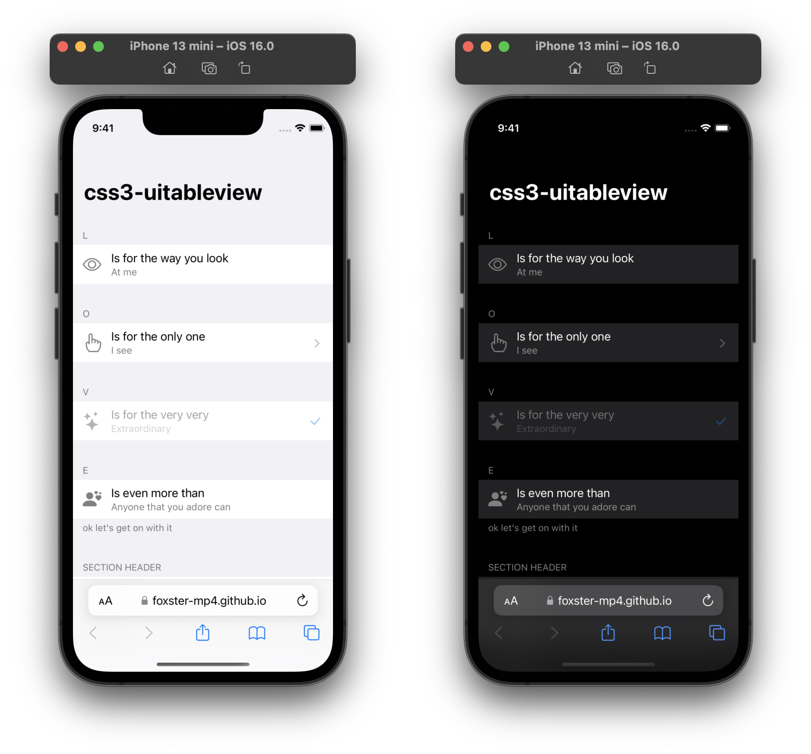

# css3-uitableview
CSS3 framework to achieve UITableView in HTML



## Get Started
Include **uitableview.css**
```html
<link rel="stylesheet" href="https://foxster-mp4.github.io/css3-uitableview/src/uitableview.css">
```

Include one of the following
* **uitableview.auto-dark.css** to have the page automatically switch between light/dark appearance according to the system appearance
```html
<link rel="stylesheet" href="https://foxster-mp4.github.io/css3-uitableview/src/uitableview.auto-dark.css">
```

* **uitableview.js** to set light/dark appearance manually in your code (by default, this will remove **uitableview.auto-dark.css**, effectively disabling automatic appearance switching)
```html
<script src="https://foxster-mp4.github.io/css3-uitableview/src/uitableview.js"></script>
```

You may also include [Bootstrap Icons](https://icons.getbootstrap.com) to add cell icons with ease (using `<i class="bi bi-<icon-name>">`; see [icon font usage](https://icons.getbootstrap.com/#external-image))
```html
<!-- Bootstrap Icons v1.9.1 -->
<link rel="stylesheet" href="https://cdn.jsdelivr.net/npm/bootstrap-icons@1.9.1/font/bootstrap-icons.css">
<!-- Visit https://icons.getbootstrap.com/#install to grab the latest version -->
```

## Structure
```
body#uitableview | div#uitableview [.dark] [.no-cell-background]
-- [h1#title]
-- div.section-container [.rounded]
---- div.section
------ [p.section-header]
------ div.cell | a.cell [.transparent] [.clickable] [.disabled]
-------- [div.cell-icon]
---------- [img.icon] | [i.bi]
-------- div.cell-inner
---------- div.cell-labels
------------ p.cell-text
------------ [p.cell-detail-text]
---------- [div.cell-accessory-icon [.grey]]
------------ [i.bi]
------ [p.section-footer]
```
### Notes
* Selectors in square brackets are optional
* In a section, all cells should be of the same tag

## See It in Action
* Demo: https://foxster-mp4.github.io/css3-uitableview/
* Working project: https://foxster-mp4.github.io/everywhere/

## License
[The MIT License](LICENSE.md)